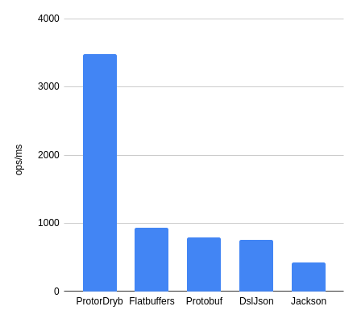

ProtoDryb
=========

ProtoDryb is new **BLAZINGLY FAST** serialization library for POJO classes.

ProtoDryb library is designed for performance with ZERO runtime overhead.



## Features
* works on existing POJO classes with just annotation processing
* **ZERO runtime overhead** - no reflection, no bytecode manipulation, no proxies
* **Zero extra memory allocations** - no extra memory allocations during serialization

## Usage
### Java
```java
public class MyPojo {
    private String stringVar;
    private int intVar;
    private boolean booleanVar;
    
    // ...getters and setters...
}
```
    
```java
@Serializer
public interface MyPojoSerializer extends SerializerService<MyPojo> {
    MyPojoSerializer INSTANCE = Serializers.getSerializer(MyPojoSerializer.class);
}
```

## TODOs
list of things to do with mark of undone
- [x] add support for arrays
- [ ] add support for collections
- [x] add support for nested objects
- [ ] add bit packing for primitive types (compact varints)
- [ ] add deserialization
- [ ] add non required fields
- [ ] add lombok support